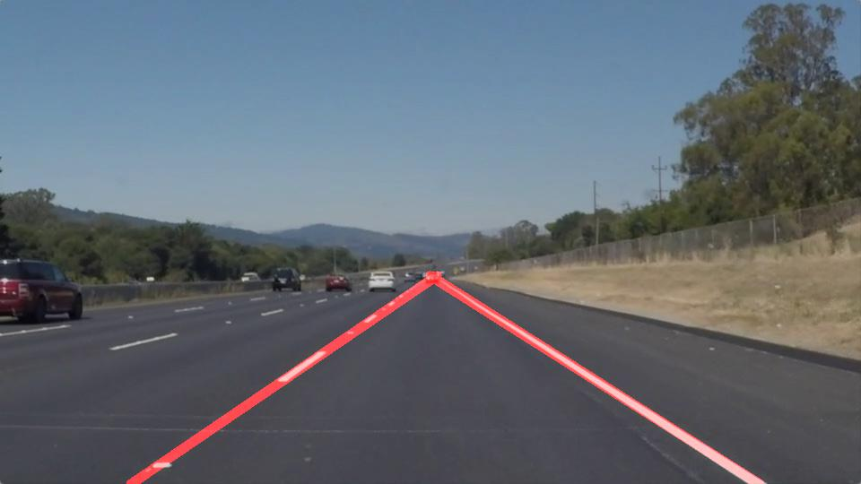
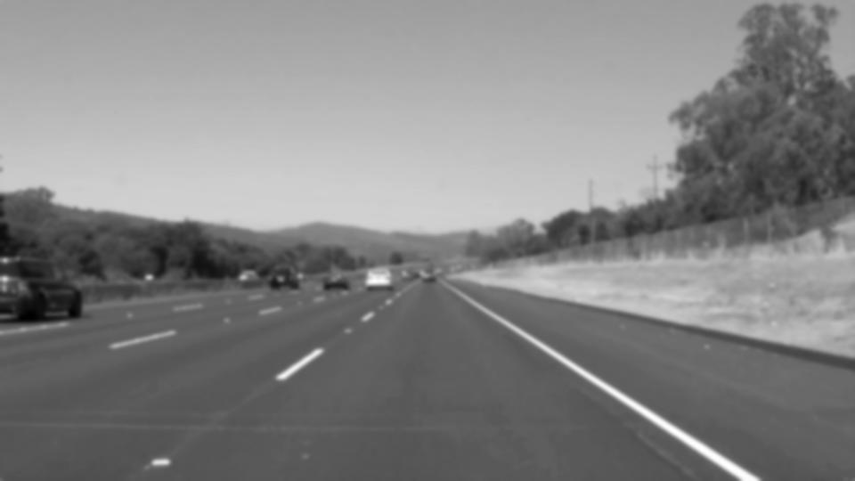
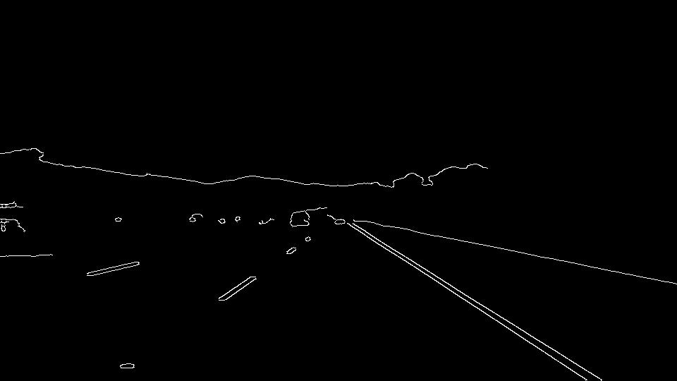
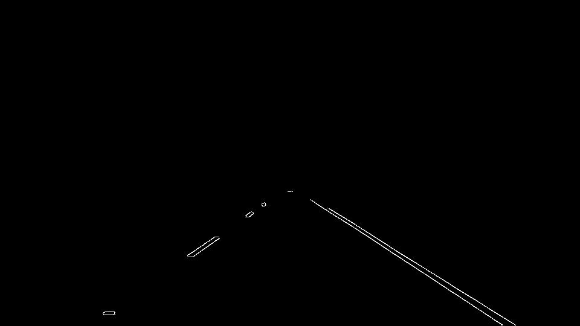

# **Finding Lane Lines on the Road** 

## Overview

When we drive, we use our eyes to decide where to go.  The lines on the road that show us where the lanes are act as our constant reference for where to steer the vehicle.  Naturally, one of the first things we would like to do in developing a self-driving car is to automatically detect lane lines using an algorithm.

In this project you will detect lane lines in images using Python and OpenCV.

## Proposed Solution

* Read image from the directory and convert it to gray

* Smooth image using Gaussian filter

* Apply Canny edge detection algorithm

* Mask image for region of interest

* Apply Hough Transform and extrapolate line over the region of interest

* Overlay original image with lines

To mask the image and focus on region of interest I used static values in the algorithm.

To draw only one line on left and right lane I used lines obtained from Hough Transform.

Calculated slope for each line and separate out lines in left and right based on positive and negative slope.

Find the line passing through these left and right lines using "polyfit" function and extend those line intersection over the region of interest.

## Potential Shortcomings

Region of interest co-ordinates are static in the code to make the algorithm more robust those values should be calculated based on how the camera is mounted and if there is hood of the ccar visible in the view.

I am not considering the color of the lanes to find the edges on the road, thats why it is failing in challenge video.

Also it will only work if there is enough light, this algorithm wont work in dark.

## Possible improvements

Dynamically vary the region of interest.

Use lane color to identify lanes within the region of interest.

Use HSV domain of the image to nullify the effect of brightness in the captured image.